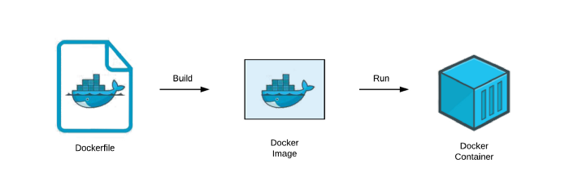
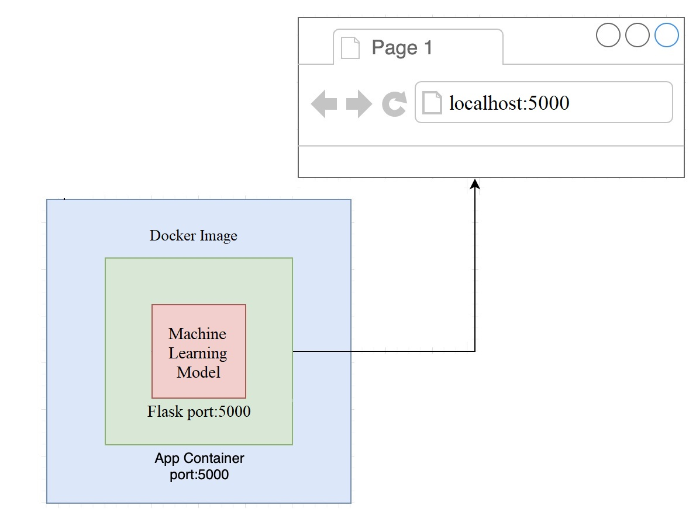
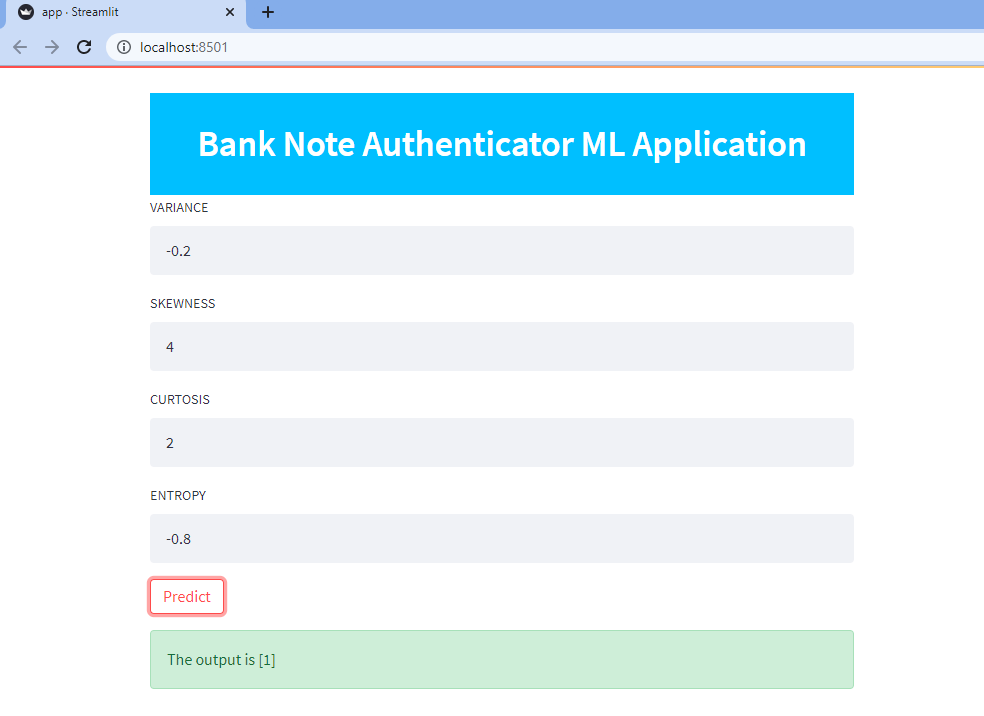

# Dockerize and Deploy Machine Learning Model

A simple Web application that can serve predictions machine learning model. 
Reads a pickled sklearn model into memory when the Web app is started and returns predictions through the 
"/predict" endpoint.

## Steps for deploying ML model

1. Install Streamlit and Docker
2. Serialise your scikit-learn model (this can be done using Pickle, or JobLib)
3. Create a separate "app.py" file which will build the web service using Streamlit
     
      i. To run streamlit run app.py

      ii. Go to http address to check if its working

4.Create a dockerfile which does the below items

       i. Install base image as python:3.6.6-slim

      ii. Move local python code to /app in container

      iii.Set WORKDIR to /app  

       iv.Install packages in requirements.txt

        v.Expose the port 5000 for webapp endpoint

       vi.Define run command as streamlit run app.py
          
5.Build docker image

6.Run docker container

7.Go to http address to check if its working

8.Push the docker container to docker registry to production

## Dockerizing 

## Docker commands

Note: Docker tag or id should be always specified in the end of the docker command to avoid issues

1.Build docker image from Dockerfile

  docker build . -t "<app name>"

2.Run the docker container after build

  docker run -p 8000:5000 "<app name>"

3.Show all running containers

  docker ps

4.Open bash in a running docker container (optional)
  
  docker exec -ti <containerid> bash

5.Kill and remove running container
  
  docker rm <containerid>

## Deployment 

- Web App Working 

## Tech Stack

**Programming Language:** Python

**Libraries:** tensorflow,numpy,scikit-learn,pandas,streamlit

**IDE:** Pycharm 

